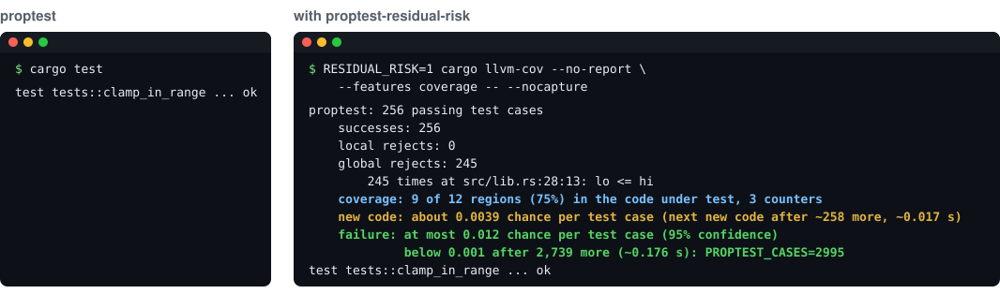

<p align="center">
  
</p>

<h1 align="center">proptest-residual-risk</h1>

<p align="center"><b>How much has a passing <a href="https://github.com/proptest-rs/proptest">proptest</a> shown?</b><br>Coverage, the chance of new code, and a 95% failure bound for every passing test.</p>

<p align="center">
  <a href="https://github.com/niMgnoeSeeL/proptest-residual-risk/actions/workflows/ci.yml"></a>
  
  
  
</p>

When a proptest test passes, `cargo test` prints `ok` and nothing else. 256 test cases found no counterexample, but was 256 enough? This crate reports three numbers for every passing test, without changing how proptest generates or runs test cases:

| Number | What it answers | Needs |
| --- | --- | --- |
| **Failure bound** | At most how likely is the next test case to fail, and how many test cases would bring that below a target? | Nothing |
| **Coverage** | How much of the code under test did the passing test cases run? | A coverage build |
| **Chance of new code** | How likely is the next test case to run code that no test case has run yet? | A coverage build |

How each number is defined, and what it assumes: [docs/theory.md](docs/theory.md).

> Version 0.1.0, not yet on crates.io. Written with the help of an AI assistant (Claude, by Anthropic). Every number here was measured with this crate: [docs/evidence.md](docs/evidence.md).

## Quick start

```toml
# Cargo.toml
[dev-dependencies]
proptest-residual-risk = { git = "https://github.com/niMgnoeSeeL/proptest-residual-risk" }
```

```rust
use proptest::prelude::*;
use proptest_residual_risk::proptest; // replaces proptest's macro; tests stay as they are
```

```console
$ RESIDUAL_RISK=1 cargo test -- --nocapture
proptest: 256 passing test cases
    ...
    failure: at most 0.012 chance per test case (95% confidence)
             below 0.001 after 2,739 more (~0.181 s): PROPTEST_CASES=2995
```

## Coverage and the chance of new code

Turn on the `coverage` feature and run the tests under [cargo-llvm-cov](https://github.com/taiki-e/cargo-llvm-cov), one test at a time:

```toml
proptest-residual-risk = { git = "https://github.com/niMgnoeSeeL/proptest-residual-risk", features = ["coverage"] }
```

```bash
cargo install cargo-llvm-cov   # once
RESIDUAL_RISK=1 cargo llvm-cov --no-report -- --test-threads=1 --nocapture
```

cargo-llvm-cov instruments only your own crates, not dependencies such as proptest, which keeps the cost down: 2.25× the time of plain proptest on 11 real crates, against 3.42× with `RUSTFLAGS="-C instrument-coverage" cargo test` ([cost](docs/evidence.md#the-cost)). Drop `--no-report` to also get cargo-llvm-cov's usual report. With `cargo llvm-cov nextest`, which runs every test in its own process, `--test-threads=1` is not needed.

## Reading the output

The right-hand side of the picture above, line by line:

| Line | Meaning |
| --- | --- |
| `256 passing test cases`, `successes`, `rejects` | The statistics block proptest prints when a test fails, now also for passing tests. n = 256 counts only newly generated test cases that passed; inputs discarded by `prop_assume!` are the rejects. |
| `coverage: 9 of 12 regions (75%)` | The code under test has 12 coverage regions (source ranges the compiler tracks); the 256 test cases ran 9 of them. `3 counters` is how many LLVM counters went up. |
| `new code: about 0.0039 chance per test case` | Estimated chance that test case 257 runs a region none of the 256 ran; `~258 more` is 1 / 0.0039, and `~0.017 s` is that many test cases at this test's speed. **"about"** means an estimate, not a bound. |
| `failure: at most 0.012 chance per test case (95% confidence)` | Upper bound 1 − 0.05<sup>1/n</sup> on the chance that one more test case from this strategy fails. **"95% confidence"** means: over many passing tests, at most about 5% of these bounds are below their test's true failure probability. It does not mean this one bound is right with probability 0.95. |
| `below 0.001 after 2,739 more: PROPTEST_CASES=2995` | Passing test cases needed in total to bring the bound below 0.001 (the target is set with `RESIDUAL_RISK_TARGET`). The crate only reports this; it never runs more test cases than `cases`. |

## Caveats

> [!IMPORTANT]
> - **The failure bound and the chance of new code both assume that test cases are independent draws.** proptest meets this: it draws every test case afresh from the strategy, without mutating or steering by earlier ones. A proptest setting that changed this (such as the edge-bias proposal in proptest #515) would make both numbers invalid.
> - **The chance of new code is an estimate, not a bound.** It is right on average, but in 18% of the campaigns we measured it was below the true rate.
> - **The chance of new code does not bound the chance of failure.** The next test case can be more likely to fail than to run new code; in the example on the theory page they are 0.0099 against 0.0039. Use the failure bound for "how likely is a failure".
> - **Everything is about the test's strategy**, not about the inputs your code meets in production. The failure bound is not the chance that your code has a bug.
> - **Measure coverage in a debug build, one test at a time.** Optimisation can drop counter updates, and LLVM's counters are shared by the whole process.
> - **LLVM 23** (Rust nightlies from 2026-08-06) is not supported for regions; the output says so and counts counters instead.
>
> Details and examples: [Theory, assumptions and caveats](docs/theory.md#assumptions-and-caveats).

## Documentation

| Page | What is in it |
| --- | --- |
| [Theory](docs/theory.md) | Which test cases are counted; the definitions of the three numbers; why regions and not counters; the assumptions and caveats, with examples |
| [Evidence](docs/evidence.md) | Whether the failure bound holds, how accurate the chance of new code is, and what the crate costs, measured on Etna and 57 real crates |
| [Reference](docs/reference.md) | Environment variables, the record file each test writes, how the crate works, all known limitations, and running this crate's tests |

## Supported versions

Rust 1.86 or newer; coverage needs LLVM 19–22 (stable rustc 1.86–1.98). proptest 1.10 and 1.11. Tested in CI on Linux and macOS, and with Rust 1.86.

## License

Licensed under either of the [Apache License, Version 2.0](LICENSE-APACHE) or the [MIT license](LICENSE-MIT), at your option.
