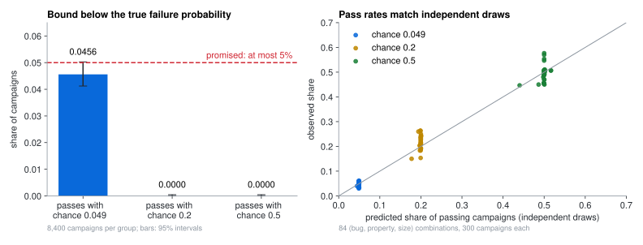
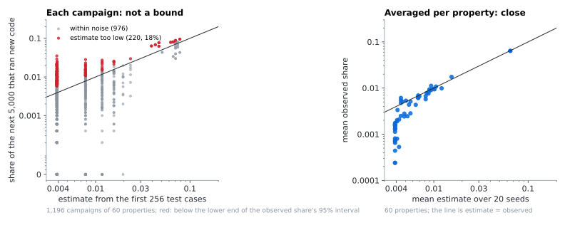
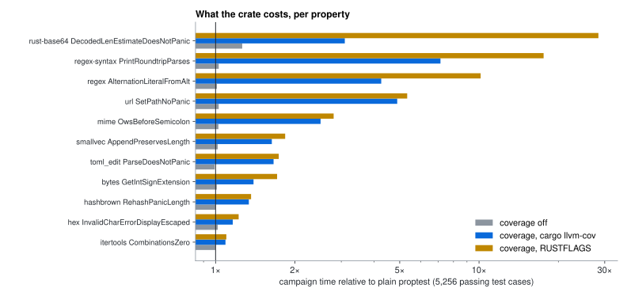

# Evidence

[← README](../README.md) · [Theory](theory.md) · **Evidence** · [Reference](reference.md)

Three questions, each measured with this crate (proptest 1.11.0, rustc 1.98.1, macOS arm64, September 2026):

| Question | Answer | Measured on |
| --- | --- | --- |
| [Does the failure bound hold?](#the-failure-bound) | **Yes.** Below the true failure probability in 4.6% of the campaigns where it can be wrong; the promise is at most 5%. | 28 bugs in Etna, 25,200 campaigns |
| [Is the chance of new code accurate?](#the-chance-of-new-code) | **On average, yes. Per run, no:** too low in 18% of campaigns. It is an estimate, not a bound. | 199 properties of 57 real crates, 3,976 campaigns |
| [What does it cost?](#the-cost) | **1.03×** with coverage off, **2.25×** with coverage under cargo-llvm-cov, **3.42×** with `RUSTFLAGS` (time relative to plain proptest, geometric mean) | 11 properties of those crates |

A *campaign* is one run of one test: its test cases until it passes (or fails).

## The failure bound

- The bound can only be wrong when a campaign passes although the test can fail, and only when the test passes with a chance below 0.05: then the bound after $n$ passing test cases is below the true failure probability. In the group where tests pass with chance 0.049, 383 of 8,400 campaigns (0.0456, 95% interval 0.0412–0.0503) passed with a bound below the true failure probability: within the promised 5%.
- In the groups with chance 0.2 and 0.5 the bound cannot be below the truth, and it never was. These groups check that the crate counts $n$ correctly and that nothing else goes wrong.
- The share of passing campaigns matched what independent draws predict in all 84 combinations (right), which is the assumption behind the bound ([theory](theory.md#independent-test-cases-the-failure-bound-and-the-chance-of-new-code)).
- In all 25,200 campaigns the crate's $n$ equalled proptest's `successes`.

How it was measured

- **Tests:** 28 (bug, property) pairs from the Rust workloads of Etna (Shi et al., ICFP 2023): binary search tree, red-black tree and simply typed lambda calculus, each with injected bugs. Three properties that fail even on the correct code were left out.
- **True failure probability:** independent draws from the property's strategy until 100 failures or $10^7$ draws, with an exact binomial 95% interval.
- **Campaigns:** for each pair, the number of test cases at which a campaign passes with chance 0.049, 0.2 and 0.5 under independent draws; 300 seeds at each size, through this crate's macro.
- **Counted as wrong:** a passing campaign whose bound $1 - 0.05^{1/n}$ is below the true failure probability.

## The chance of new code

- **Averaged per property (right), the estimate is close to the truth:** mean estimate 0.0077 against mean observed 0.0060 over the 60 properties where it rose above its floor.
- **Per campaign (left), it is not a bound:** in 220 of 1,196 campaigns (18%) the estimate was below the lower end of the observed share's 95% interval. It fluctuates from seed to seed, sometimes in the wrong direction: a seed that happens to miss a rare path sees fewer singletons and so a lower estimate.
- In the other 139 properties the estimate stayed at its floor $1/258$, and the later test cases almost never ran new code (mean observed share 0.00001).
- **Counting regions rather than counters matters:** of 19.9 million later test cases, 36,173 ran a new region but only 30,957 raised a new counter. Counters miss 14% of the test cases that ran new code.

| Counted in | Later test cases that ran new code |
| --- | ---: |
| LLVM counters | 30,957 |
| Regions | 36,173 (+17%) |

How it was measured

- **Tests:** all 205 proptest properties of the 57 Rust crates adapted for Etna ("etna-ify" workloads: url, smallvec, itertools, toml_edit, regex and others). Six had no usable seed (they fail on the correct code, or ran past the time limit), leaving 199.
- **Campaigns:** 20 seeds per property, 5,256 passing test cases each, in debug builds with coverage.
- **Estimate:** the chance of new code computed from the first 256 test cases, as the crate prints it.
- **Truth:** the share of the next 5,000 test cases that ran a region none of the first 256 ran. Because proptest's test cases are independent draws, this share estimates the true chance after 256 test cases.
- **Too low:** the estimate is below the lower end of the exact (Clopper–Pearson) 95% interval of that share.
- **Optimised builds:** three of the crates build their tests at opt-level 3. Rerunning them in debug builds (160 campaigns) gave the same estimates and observed shares in every campaign.

## The cost

| Setting | Time relative to plain proptest: geometric mean (range) |
| --- | --- |
| Coverage off (the failure bound only) | 1.03× (0.99–1.26×) |
| Coverage, under `cargo llvm-cov --no-report` | 2.25× (1.09–7.14×) |
| Coverage, with `RUSTFLAGS="-C instrument-coverage"` | 3.42× (1.10–28.39×) |
| For comparison: plain proptest under cargo-llvm-cov, test run / with report | 1.08× / 2.70× |

- **Where the time goes:** most of it is reading and comparing the counters of the code under test before and after each test case. With `RUSTFLAGS`, dependencies such as proptest are instrumented too; that blocks optimisation in the three crates that build tests at opt-level 3 (base64, regex-syntax, regex), which is why their bars are long. cargo-llvm-cov leaves dependencies alone and counts the same regions.
- **Once per process:** reading the coverage mapping takes 0.009–0.07 s. **Once per campaign:** computing the numbers takes 0.001–0.18 s.
- **Other options measured:** taking coverage for only every 4th or 16th test case (`RESIDUAL_RISK_COVERAGE_EVERY`) costs 2.44× or 2.15× with `RUSTFLAGS`, but estimates the chance of new code from fewer test cases. Release builds make it worse (16.7× relative to plain proptest in release) and drop some counter updates.

How it was measured

- **Tests:** 11 of the properties above, chosen before timing to span cheap and expensive test bodies, small and large crates, and many rejected inputs.
- **Campaigns:** 5,256 passing test cases, seeds 1–3, one process at a time; for every property and seed all settings ran one after another in rotating order, so that they saw the same machine load.
- **Numbers:** the median campaign time per property, divided by that of plain proptest; the geometric mean over the 11 properties.
- The measurement scripts and raw results belong to the research project this crate came from and are not in this repository.

